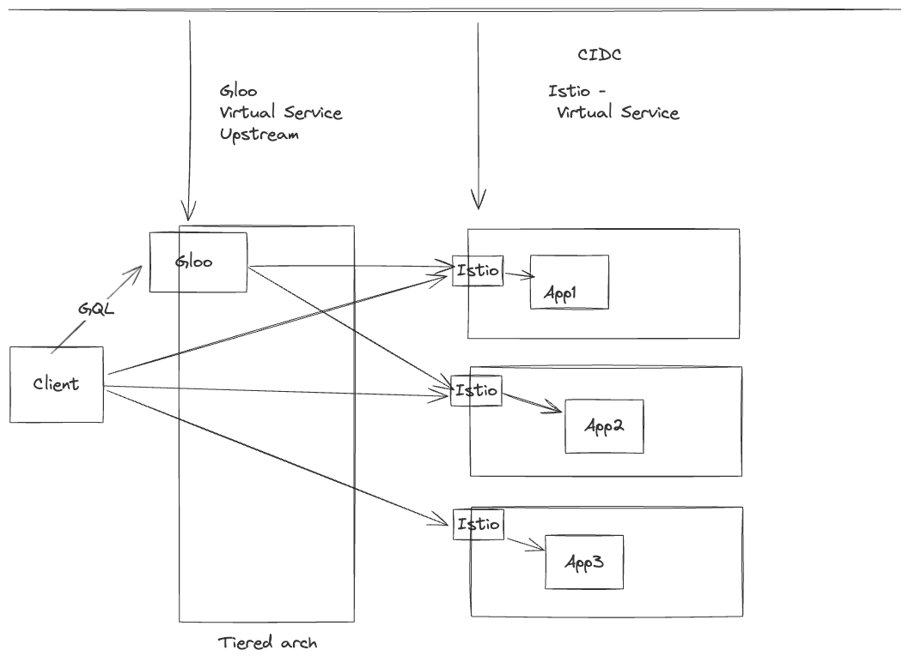
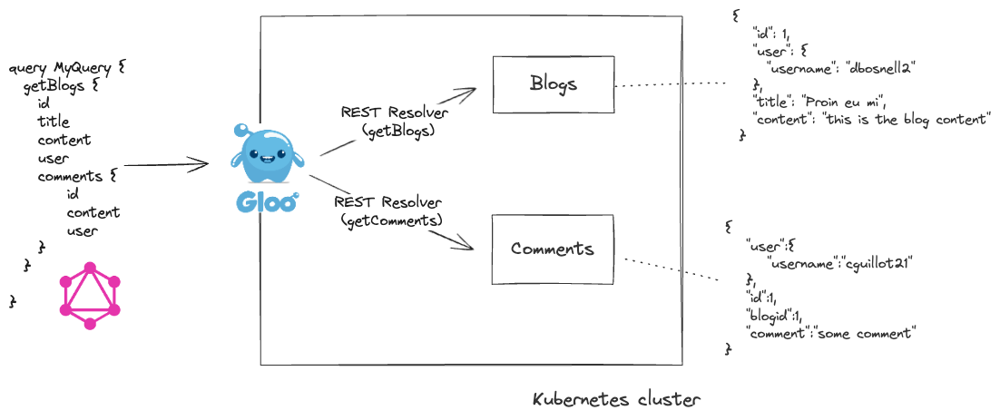

# zi-ge-qgl-poc


# POC Architecture 



# Requirement

Before we start, please get familiar with Gloo Edge Basics, the following helloworld guide is sufficient: https://docs.solo.io/gloo-edge/latest/guides/traffic_management/hello_world/


- Kubernetes clusters, can be local like kind, k3d, minikube, or a cloud environement like GKE, EKS.. 
- 1 core/1k rps
- about 1Go mem/1k rps 

# Installation 


Install Gloo Gateway Enterprise on your cluster using the following helm chart: 

```
helm repo add glooe https://storage.googleapis.com/gloo-ee-helm
helm install gloo glooe/gloo-ee --namespace gloo-system --create-namespace --set-string license_key=$LICENSE
```


## Demo Env 



```
# Blogs 
kubectl apply -f https://raw.githubusercontent.com/solo-io/gloo-graphql-example/main/manifests/svcs/blogs.yaml
# Comments
kubectl apply -f https://raw.githubusercontent.com/solo-io/gloo-graphql-example/main/manifests/svcs/comments.yaml
```


# Using REST resolvers 

To do this in Gloo Gateway we will create some configuration. To start, we will create the GraphQL schema, which contains the resolvers: 


```
apiVersion: graphql.gloo.solo.io/v1beta1
kind: GraphQLApi
metadata:
  name: blogs-graphql
  namespace: gloo-system
spec:
  options:
    logSensitiveInfo: true
  executableSchema:
    executor:
      local:
        enableIntrospection: true
        resolutions:
          getBlogs:
            restResolver:
              request:
                headers:
                  :method: GET
                  :path: /blogs
              upstreamRef:
                name: default-blogs-80
                namespace: gloo-system
          getComments:
            restResolver:
              request:
                headers:
                  :method: GET
                  :path: /comments?blogid={$parent.id}
              upstreamRef:
                name: default-comments-80
                namespace: gloo-system

    schemaDefinition: |
      type Query {
        """Description of a blogs in HTML"""
        getBlogs: [Blog] @resolve(name: "getBlogs")
      }

      type Blog {
        id: Int
        user: User
        content: String
        title: String
        comments: [Comment] @resolve(name: "getComments")
      }

      type Comment {
        id: Int
        user: User
        comment: String
      }

      type User {
        username: String
      }
```


Let’s understand the configuration above – we create a GraphQLApi custom resource in our Kubernetes cluster. The GraphQLApi contains two resolvers, getBlogs and getComments,
getBlogs gets the blogs from the blogs service, getComments is then invoked to get all the comments related to a blog passing the blogId in a query parameter. 


Now, to expose the GraphQL API to the public using the virtual service, create the following configuration: 


```
apiVersion: gateway.solo.io/v1
kind: VirtualService
metadata:
  name: default
  namespace: gloo-system
spec:
  virtualHost:
    domains:
    - '*'
    options:
      cors:
        allowCredentials: true
        allowHeaders:
        - content-type
        allowMethods:
        - POST
        allowOriginRegex:
        - '/*'
    routes:
      # ----------- Route to the Declared GraphQL API -----------
    - graphqlApiRef:
        name: blogs-graphql
        namespace: gloo-system
      matchers:
      - prefix: /graphql
```

Now your GraphQL API is exposed, and you can send your requests. For example, let’s retrieve the blogs and their related comments using the following query:


```
 query MyQuery {
   getBlogs {
     comments {
       comment
       id
       user {
         username
       }
     }
     content
     id
     title
     user {
       username
     }
   }
 }

```


You should get a result like this: 

```
{
 "data": {
   "getBlogs": [
     {
       "id": 1,
       "title": "Proin eu mi",
       "content": "Proin eu mi. Nulla ac enim. In tempor...",
       "user": {
         "username": "dbosnell2"
       },
       "comments": [
         {
           "id": 1,
           "comment": "Fusce consequat. Nulla nisl. Nunc nisl...",
           "user": {
             "username": "cguillot21"
           }
         },
         {
           "id": 13,
           "comment": "Vestibulum ac est lacinia nisi venenatis...",
           "user": {
             "username": "ballonby2a"
           }
         },
         {
           "id": 16,
           "comment": "In sagittis dui vel nisl....",
           "user": {
             "username": "baguilar27"
           }
         }
       ]
     }
   ]
 }
}
```


# Using GraphQL remote execution (Proxied GraphQL API)


Apply the following configuration to represent the proxied User GraphQL API: 


```
apiVersion: graphql.gloo.solo.io/v1beta1
kind: GraphQLApi
metadata:
  name: remote-graphql-users
  namespace: gloo-system
spec:
  options:
     logSensitiveInfo: true
  executableSchema:
    executor:
      remote:
        upstreamRef:
          name: default-users-80
          namespace: gloo-system
    schemaDefinition: |
      type User {
        id: Int!
        username: String
        lastname: String
        firstname: String
      }

      type Query {
        getUserDetails(username: String!): User
      }
```
This GraphQL API is proxying the query getUserDetails to upstream default-users-80, which is the Apollo GraphQL server. 


# Stitching multiple GraphQL APIs 


create the stitched schema using the following configuration: 


```
apiVersion: graphql.gloo.solo.io/v1beta1
kind: GraphQLApi
metadata:
  name: stitched-gql
  namespace: gloo-system
spec:
  options:
     logSensitiveInfo: true
  stitchedSchema:
    subschemas:
    - name: remote-graphql-users
      namespace: gloo-system
      typeMerge:
        User:
          # The selectionSet declares that the username from the Blogs service will be used as the key
          # to fetch the user details from the Users service.
          selectionSet: '{ username }'
          queryName: getUserDetails
          args:
            username: username
    - name: blogs-graphql
      namespace: gloo-system
```

It is important to note that in the stitched GraphQL API we defined a typeMerge for the type User; this will invoke the query getUserDetails based on a username during the merge. 

Finally, expose this new stitched GraphQL schema using a virtual Service; we will just update the existing one: 


```
apiVersion: gateway.solo.io/v1
kind: VirtualService
metadata:
  name: default
  namespace: gloo-system
spec:
  virtualHost:
    domains:
    - '*'
    options:
      cors:
        allowCredentials: true
        allowHeaders:
        - content-type
        allowMethods:
        - POST
        allowOriginRegex:
        - '/*'
    routes:
      # ----------- Route to the Stitched GraphQL API -----------
    - graphqlApiRef:
        name: stitched-gql
        namespace: gloo-system
      matchers:
      - prefix: /graphql
```

You can try the stitched GraphQL API now making the following query: 

```
 query MyQuery {
   getBlogs {
     comments {
       comment
       id
       user {
         username
         firstname
         lastname
       }
     }
     content
     id
     title
     user {
       username
       firstname
       lastname
     }
   }
 }
```


You should get the following response: 

```

{
        "comments": [
          {
            "comment": "Fusce consequat. Nulla nisl. Nunc nisl.\n\nDuis bibendum, felis sed interdum venenatis, turpis enim blandit mi, in porttitor pede justo eu massa. Donec dapibus. Duis at velit eu est congue elementum.",
            "id": 1,
            "user": {
              "username": "cguillot21",
              "firstname": "Correy",
              "lastname": "Guillot"
            }
          },
          {
            "comment": "Vestibulum ac ....",
            "id": 13,
            "user": {
              "username": "ballonby2a",
              "firstname": "Bendite",
              "lastname": "Allonby"
            }
          },
          {
            "comment": "In sagittis dui vel nisl. Duis ac nibh. Fusce lacus purus, aliquet at, feugiat non, pretium quis, lectus.",
            "id": 16,
            "user": {
              "username": "baguilar27",
              "firstname": "Braden",
              "lastname": "Aguilar"
            }
          }
        ],
        "content": "Proin eu mi. Nulla ac enim. In tempor, turpis nec euismod scelerisque, quam turpis adipiscing lorem, vitae mattis nibh ligula nec sem.",
        "id": 1,
        "title": "Proin eu mi",
        "user": {
          "username": "dbosnell2",
          "firstname": "Dalia",
          "lastname": "Bosnell"
        }
      },
```
